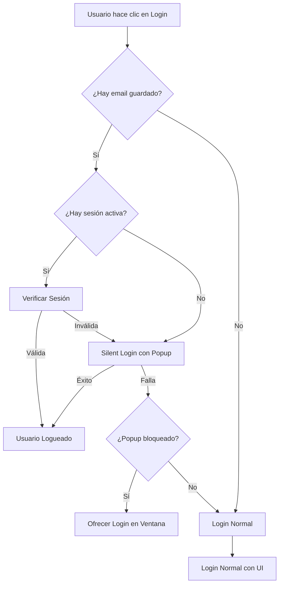

# Implementación de Autenticación Inteligente - Frontend

## Resumen

Se ha implementado un sistema de autenticación inteligente por capas que mejora significativamente la experiencia del usuario al eliminar la pantalla de consentimiento innecesaria para usuarios registrados.

## Arquitectura del Sistema

### Flujo de Autenticación Inteligente



### Componentes Principales

#### 1. AuthContext (`src/contexts/AuthContext.jsx`)

**Funciones Clave:**

- `loginWithGoogle()`: Función inteligente que detecta el tipo de usuario
- `attemptSilentLogin(email)`: Silent login usando popup
- `checkExistingSession()`: Verificación robusta de sesión
- `hasActiveSession()`: Detección de cookies de sesión
- `processLoginCallback()`: Procesamiento de callbacks con parámetros

**Estrategia de Login:**

1. **Usuario ya logueado**: Verifica sesión existente
2. **Usuario registrado sin sesión**: Intenta silent login
3. **Usuario nuevo**: Login normal con UI completa
4. **Popup bloqueado**: Ofrece alternativa con redirección

#### 2. AuthCallback (`src/pages/AuthCallback.jsx`)

**Manejo de Respuestas:**

- `login=success`: Login exitoso del backend
- `login=error`: Error con mensaje específico
- `code`: Código de autorización (legacy)
- `error`: Error de Google OAuth

**Comunicación con Popup:**

- Usa `window.opener.postMessage()` para comunicarse con el popup
- Cierra automáticamente el popup después del login
- Maneja tanto popups como redirecciones normales

#### 3. LoginButton (`src/components/LoginButton.jsx`)

**Mejoras de UX:**

- Muestra estado del proceso de login
- Indica si el usuario ya está logueado
- Manejo visual de errores y éxitos
- Información sobre experiencia de usuarios registrados

## Endpoints del Backend Utilizados

### 1. Silent Login
```
GET /api/auth/google/silent?email=usuario@email.com
```
- **Propósito**: Login automático sin UI
- **Comportamiento**: 
  - Si usuario logueado en Google → Login inmediato
  - Si no → Redirige con error

### 2. Login Normal
```
GET /api/auth/google/login?prompt=consent
```
- **Propósito**: Login con UI completa
- **Parámetros**: `prompt` (consent, select_account, none)

### 3. Verificación de Sesión
```
GET /api/auth/session
```
- **Propósito**: Verificar sesión activa
- **Respuesta**: Datos del usuario o 401

### 4. Callback
```
GET /api/auth/google/callback
```
- **Propósito**: Procesar respuesta de Google
- **Redirección**: `?login=success` o `?login=error&message=...`

## Beneficios de la Implementación

### 1. Experiencia de Usuario Mejorada
- **Usuarios registrados**: No ven pantallas de consentimiento innecesarias
- **Usuarios nuevos**: Experiencia completa de registro
- **Fallback robusto**: Si silent login falla, automáticamente usa login normal

### 2. Detección Inteligente
- **Cookies de sesión**: Detecta sesiones activas
- **Email guardado**: Recuerda usuarios registrados
- **Popup bloqueado**: Detecta y maneja restricciones del navegador

### 3. Manejo de Errores Robusto
- **Errores de red**: No desloguea por problemas temporales
- **Sesiones expiradas**: Limpia estado local automáticamente
- **Popup bloqueado**: Ofrece alternativa con redirección

### 4. Compatibilidad
- **Legacy support**: Mantiene compatibilidad con código existente
- **Múltiples navegadores**: Funciona con diferentes configuraciones de popup
- **Responsive**: Adapta la experiencia según el contexto

## Configuración Técnica

### Cookies de Sesión
El sistema detecta las siguientes cookies de sesión:
- `session_token`
- `sessionid`
- `connect.sid`

### Timeouts
- **Silent login**: 15 segundos
- **Verificación de sesión**: Sin timeout específico
- **Popup check**: 1 segundo

### Comunicación entre Ventanas
- **Popup → Parent**: `window.opener.postMessage()`
- **Mensajes**: `LOGIN_OK`, `LOGIN_FAILED`
- **Cleanup**: Cierre automático y limpieza de listeners

## Casos de Uso

### 1. Usuario Nuevo
1. Hace clic en "Continuar con Google"
2. Se redirige a login normal con UI completa
3. Completa el proceso de autorización
4. Se guarda el email para futuros silent logins

### 2. Usuario Registrado (Primera visita)
1. Hace clic en "Continuar con Google"
2. Se detecta email guardado
3. Se abre popup para silent login
4. Si está logueado en Google → Login automático
5. Si no → Fallback a login normal

### 3. Usuario Registrado (Sesión activa)
1. Hace clic en "Continuar con Google"
2. Se detecta sesión activa
3. Se verifica la sesión con el backend
4. Si válida → Usuario ya logueado
5. Si inválida → Silent login

### 4. Popup Bloqueado
1. Se detecta que el popup fue bloqueado
2. Se muestra confirmación al usuario
3. Si acepta → Redirección a login normal
4. Si no → Proceso cancelado

## Monitoreo y Debugging

### Logs del Console
- `🔍 Verificando sesión existente...`
- `🔇 Intentando silent login para: email`
- `✅ Silent login exitoso`
- `❌ Silent login falló: error`
- `⚠️ Popup bloqueado, ofreciendo alternativa`

### Estados de la Aplicación
- `loading`: Verificando autenticación
- `isAuthenticated`: Usuario logueado
- `user`: Datos del usuario
- `error`: Errores de autenticación

## Consideraciones de Seguridad

### 1. Cookies HttpOnly
- Las cookies de sesión son httpOnly
- No accesibles desde JavaScript
- Protegidas contra XSS

### 2. CORS
- Configurado para permitir cookies
- Credentials incluidos en todas las requests
- Dominios específicos en producción

### 3. Timeouts
- Silent login tiene timeout de 15 segundos
- Previene popups colgados
- Limpieza automática de recursos

## Próximos Pasos

### 1. Optimizaciones
- Implementar refresh automático de sesión
- Mejorar detección de popup bloqueado
- Añadir indicadores de progreso más detallados

### 2. Testing
- Tests unitarios para funciones de autenticación
- Tests de integración para flujos completos
- Tests de compatibilidad con diferentes navegadores

### 3. Monitoreo
- Métricas de éxito de silent login
- Tiempo promedio de autenticación
- Tasa de fallback a login normal

Esta implementación proporciona una experiencia de usuario moderna y fluida, similar a aplicaciones como Gmail, donde los usuarios registrados no ven pantallas de consentimiento innecesarias.
